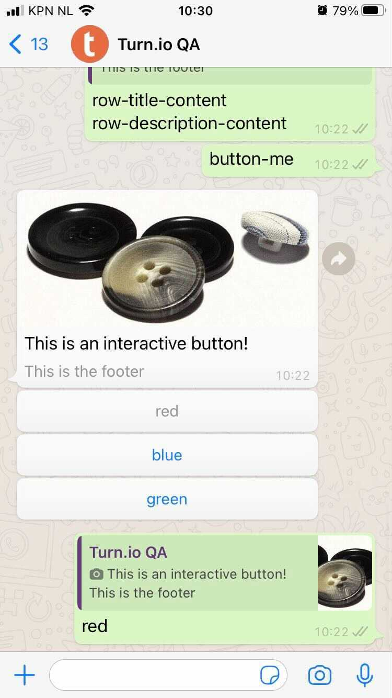
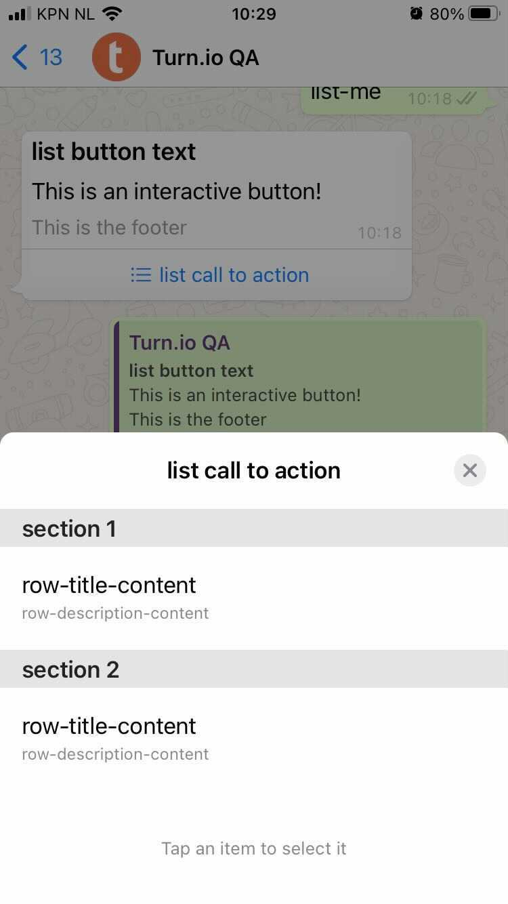

# turnio-interactive-replit

An example Turn.io webhook integration that returns the new interactive message types introduced in WhatsApp Business API 2.35.4

For this to work you need to set a Turn API token named `TOKEN` as a secret in Replit.

## How to run this Repl.it example

Click the `Run on Repl.it` button below to install this code example into your Repl.it workspace. Repl.it creates a free workspace for you to do this in. If you don't have an account yet, you can create one in the process at no cost or further commitments.

Then log-in to your account on Turn. For most this will be at https://app.turn.io. If you're on a private cloud setup then please reach out to Turn.io Support via WhatsApp if you're unsure about the address of your Turn installation.

Create a Turn Token for your number by going to "settings" and "API & Webhooks".

In your Repl.it account, go to "Secrets". Create a new entry by typing `TOKEN` into the key field and by pasting the Turn token into the value field.

Finally click the `Add new secret` button and you're all set with setting up the Repl.it application.

Now click the `Run` button at the top of the Repl.it UI to start the application.
After a few seconds, it will display an address in the top right and the output of the webserver running below it.

The address in the screenshot is https://turnio-interactive-replit.turnio.repl.co but when you run this in your own Repl.it account, it will be something different. Copy that address. Take note that the default example we're providing here is expecting Turn to forward messages to `/interactive` on the URL provided by Repl.it

Now any messages you send to your WhatsApp number (this includes any sandbox numbers) will be forwarded by Turn to your webhook.

If the message contains the text `button-me` it will return with an interactive message with buttons.

If the message contains the text `list-me` it will return with an interactive message with a list.

